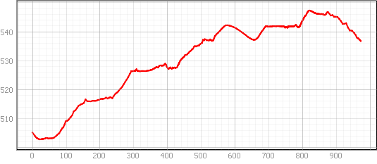
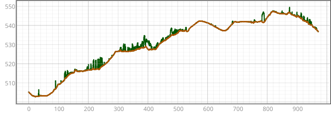
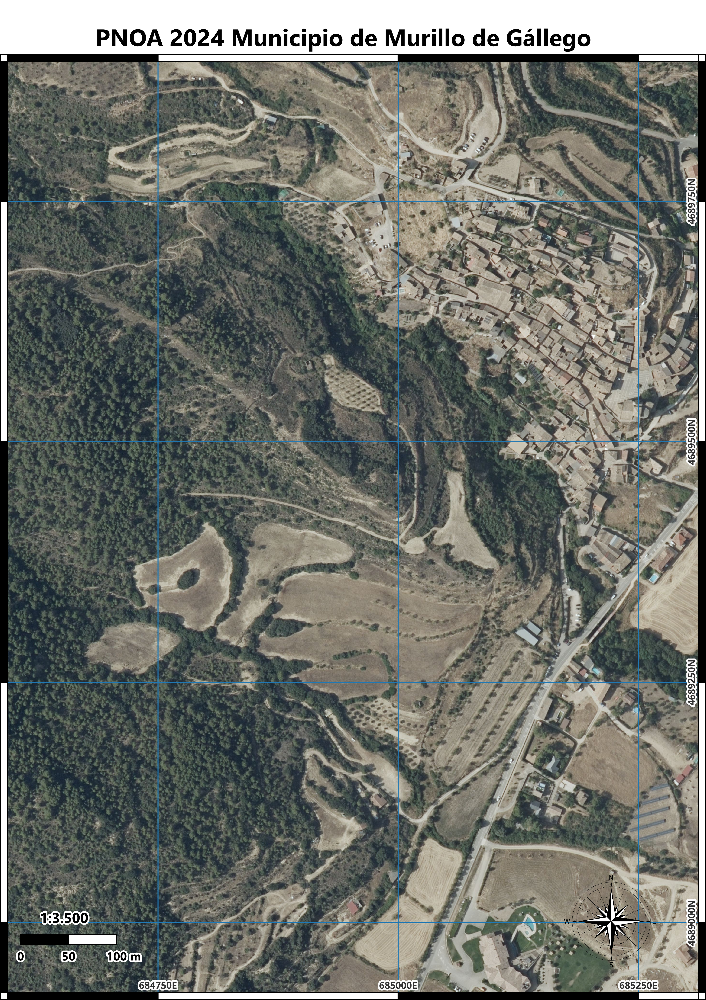

# Propuesta de camino a rehabilitar por la Asociación Mundo Rebuzno

**Autor:** Víctor Martínez Bolea\
**Fecha:** 2026-05-06

------------------------------------------------------------------------

## 1. Introducción

El presente documento tiene como finalidad apoyar la planificación de la recuperación y acondicionamiento de un camino rural en el término municipal de Murillo de Gállego (Zaragoza). La actuación se enmarca en una iniciativa de la asociación **Mundo Rebuzno**, en colaboración con el Ayuntamiento de la localidad, que plantea el uso de burros como medio para facilitar las labores de rehabilitación del trazado.

El trabajo se basa en el análisis espacial del entorno mediante herramientas de Sistemas de Información Geográfica (SIG), con el objetivo de caracterizar el recorrido potencial del camino y evaluar las condiciones del terreno para su recuperación.

------------------------------------------------------------------------

## 2. Objetivos

### Objetivo general

Digitalizar y cartografiar el trazado del camino rural a recuperar en el término municipal de Murillo de Gállego (Zaragoza), integrando información geoespacial relevante para su caracterización y análisis del entorno.

### Objetivos específicos

-   Levantamiento en campo del trazado del camino mediante GPS, para la obtención de un track georreferenciado.
-   Digitalización y edición del recorrido del camino en entorno SIG a partir del levantamiento de campo.
-   Integración de distintas fuentes cartográficas raster de referencia, incluyendo ortofotografías, Modelo Digital del Terreno (MDT) y Modelo Digital de Superficie (MDS) derivados de datos LiDAR.
-   Incorporación de elementos vectoriales del territorio, como cartografía catastral, red de carreteras y caminos existentes, incluyendo senderos de gran recorrido (GR).
-   Generación de perfiles altimétricos del trazado del camino a partir del Modelo Digital de Superficie (MDS), y generación de perfiles relacionados con la vegetación a partir del Modelo Digital del Terreno (MDT), así como la elaboración de curvas de nivel.
-   Estimación de la densidad de vegetación en el entorno del camino mediante análisis focal (ventana móvil) sobre un raster de clases de vegetación derivado de datos LiDAR.

------------------------------------------------------------------------

## 3. Área de estudio

*Figura 1. Término municipal de Murillo de Gállego.*

El área de estudio se localiza en el **término municipal de Murillo de Gállego**, en la comarca de la **Hoya de Huesca / Plana de Uesca** (provincia de Zaragoza, Aragón). El municipio tiene una extensión de **54,71 km²** y un rango altitudinal que abarca desde **420 m** (valle del Gállego) hasta **1190 m** (sierras prepirenaicas).

El clima es **mediterráneo continentalizado**, con inviernos fríos y veranos calurosos, y una precipitación media anual de 600-700 mm. La vegetación natural está dominada por **matorral mediterráneo** (coscoja, romero, aliaga) y **pinares de repoblación** (*Pinus halepensis* y *Pinus sylvestris*), con bosques de ribera en el valle del río Gállego.

El camino objeto de estudio discurre por una ladera de orientación **sur-sureste**, con pendientes variables que alcanzan hasta el **20%** en algunos tramos. La cubierta vegetal predominante en el trazado es **matorral bajo y denso**, con escasa presencia de arbolado, lo que condiciona la visibilidad y la penetración del terreno.

El tramo analizado tiene una longitud aproximada de **1 km** y salva un desnivel acumulado de **\~50 m** (entre 491 y 544 m de altitud según el MDS). El camino conecta áreas de cultivo abandonado con pistas forestales existentes, y su recuperación permitiría integrarlo en la red de senderos locales.

------------------------------------------------------------------------

## 4. Fuentes de los datos

### 4.1. Datos propios (trabajo de campo)

-   **Levantamiento del trazado del camino**: realizado mediante la aplicación [Mapas de España](https://play.google.com/store/apps/details?id=com.orux.oruxmapsIGN&pcampaignid=web_share) del Instituto Geográfico Nacional (IGN), registrando un track GPS durante el recorrido completo del camino rural.
    -   [Tutorial: Cómo grabar un track en la aplicación Mapas de España del IGN](https://www.youtube.com/watch?v=GxWrOMuwEFY)
    -   El track resultante se ha exportado en formato **GeoJSON** (`camino_mr.geojson`).
-   **Características del trazado**:
    -   **Longitud total**: aprox. 1 km
    -   **Altitud mínima**: 491,73 m
    -   **Altitud máxima**: 547,67 m
    -   **Pendiente máxima**: 20,9 % (11,8°)
    -   **Pendiente media**: 6,5 % (3,7°)
    -   **Cobertura vegetal media sobre el eje**: 0,47 m

### 4.2. Fuentes raster de referencia

Se han descargado y procesado los siguientes conjuntos de datos a través del [Centro de Descargas del IGN](https://centrodedescargas.cnig.es/):

-   **Ortofotos PNOA máxima actualidad (2024)**
-   **Vuelo Americano (1956)**
-   **LiDAR 3ª Cobertura (2023)** para generar MDS, MDT y clasificación de vegetación

### 4.3. Fuentes vectoriales

-   Del **Instituto Geográfico de Aragón (IGEAR)** mediante servicios WFS: carreteras, catastro, recorridos, masas de agua, LICs.
-   Del **Centro de Descargas del IGN**: senderos FEDME (GR, PR, SL).

------------------------------------------------------------------------

## 5. Resultados

## 5.1. Mapa base con ortofoto y trazado del camino

{width="100%"}

*Figura 2. Ortofoto PNOA 2024 con el trazado del camino.*

## 5.2. Mapa base con usos SIGPAC y trazado del camino

{width="100%"}

*Figura 3. Usos SIGPAC con el trazado del camino.*

## 5.3. Perfil altitudinal del trazado

El análisis del trazado muestra que el camino presenta una pendiente media moderada (6,5%), pero con tramos puntuales muy pendientes (\>15%) que pueden requerir trabajos de desmonte.

{width="100%"}

*Figura 4. Perfil altitudinal del camino a partir del MDS.*

## 5.4. Perfil de vegetación

La cobertura vegetal es densa en los laterales (altura media 0,47 m), aunque sobre el eje del camino la penetración es muy alta (99,9%), lo que indica que el firme está relativamente despejado pero rodeado de matorral.

{width="100%"}

*Figura 5. Altura de vegetación sobre el eje del camino.*

## 5.5. Comparativa histórica

La comparativa entre el Vuelo Americano de 1956 y la ortofoto de 2024 revela un avance significativo de la masa forestal, especialmente de pinares de repoblación, que en algunas zonas han invadido el antiguo trazado. Esto deberá tenerse en cuenta en los trabajos de desbroce.

|          PNOA 2024          |   Vuelo Americano 1956    |
|:---------------------------:|:-------------------------:|
|  |  |

*Figura 6. Comparación de la cobertura del suelo entre 1956 y 2024. Se aprecia el avance de la masa forestal.*

------------------------------------------------------------------------

## 6. Visor interactivo

Para explorar el mapa de forma interactiva con todas las capas (ortofotos históricas 1956-2024, LiDAR, MDE, pendientes, curvas de nivel y usos SIGPAC), accede al siguiente enlace:

🔗 [**Visor cartográfico interactivo - Mundo Rebuzno**](https://vmbolea.github.io/mundo_rebuzno/)

El visor permite: - Navegar por el trazado del camino sobre diferentes ortofotos (desde 1956 hasta 2024). - Visualizar capas de análisis derivadas del LiDAR: MDE, pendientes, curvas de nivel. - Consultar los usos SIGPAC del terreno. - Superponer información catastral y de caminos existentes.

------------------------------------------------------------------------

## 7. Conclusiones

El camino es **recuperable con medios tradicionales** (incluyendo el uso de burros como se propone), siempre que se realice un desbroce selectivo en una franja de 2-3 m de ancho y se corrijan los tramos con pendiente superior al 15% mediante pequeñas explanaciones o escalones de piedra seca.

La combinación de análisis SIG en local (alta resolución LiDAR) y visualización web permite una planificación detallada y accesible para todos los agentes implicados (asociación, ayuntamiento, voluntarios).

------------------------------------------------------------------------

## 📂 Datos y recursos

-   [Camino en GeoJSON](camino_mr.geojson) - Trazado del camino con atributos altimétricos y de vegetación
-   [Término municipal en GeoJSON](termino_municipal.geojson) - Límite municipal de Murillo de Gállego

------------------------------------------------------------------------

## 📄 Informe completo

El informe técnico completo (en formato HTML, con mapas interactivos integrados) está disponible para descarga:

🔗 [**Descargar informe.html**](informe.html)

> **Nota:** El informe HTML requiere descarga y apertura en navegador para visualizar correctamente los mapas interactivos.

------------------------------------------------------------------------

## 🙏 Agradecimientos

-   **Instituto Geográfico Nacional (IGN)** - Ortofotos PNOA, Vuelo Americano, LiDAR y cartografía base
-   **Instituto Geográfico de Aragón (IGEAR)** - Servicios WFS de cartografía vectorial
-   **Ayuntamiento de Murillo de Gállego** - Colaboración institucional
-   **Asociación Mundo Rebuzno** - Iniciativa y trabajo de campo

------------------------------------------------------------------------

*Documento generado el 6 de mayo de 2026*
